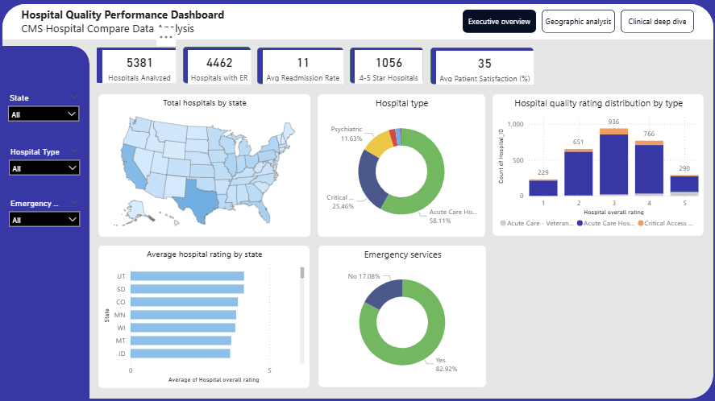

**Hospital Quality Performance Dashboard**
**Power BI | CMS Hospital Compare Data**

**Power BI link:**

This dashboard provides an overview of hospital quality and readmission performance across the United States. It is designed to help users explore hospital ratings, readmission scores, emergency service availability, and geographic patterns using real CMS (Centers for Medicare & Medicaid Services) data.

The goal of this project is to present a clean, interactive, and easy-to-understand visualization of hospital performance trends.

📌 **What This Dashboard Shows**

The dashboard is divided into three main pages, each answering a different question:

**1️. Executive Overview**

What is the overall quality and readmission landscape?

This page includes:

Total number of hospitals analyzed

Average hospital rating

Average readmission score

Percentage of hospitals with emergency services

Distribution of hospitals by type

Map showing hospital density by state

This view gives a quick snapshot of nationwide hospital performance.

**2️. Geographic Analysis**

How does hospital quality vary by state?

This page includes:

State-level average ratings

Number of hospitals per state

Percentage of hospitals providing emergency care

A scatter plot showing the relationship between hospital ratings and readmission scores

This helps compare states and identify areas with stronger or weaker health system performance.

**3️. Clinical Deep Dive**

How do hospitals perform across key clinical conditions?

This page includes:

Condition-level readmission scores (COPD, Heart Failure, Heart Attack, Pneumonia, Other)

Comparison by hospital type (Acute Care, Critical Access, Veterans)

A national benchmark line to compare condition scores

This view highlights which conditions or hospital types perform above or below national standards.

**Data Source**

CMS Hospital Compare Dataset
(Contains hospital details, ratings, emergency services, and readmission performance scores.)

🛠 Tools Used

Power BI for data cleaning, modeling, and visualization

DAX for calculated measures and benchmark comparison

Power Query for data transformation

📁 Files in This Repository
Hospital_Quality_Dashboard.pbix
/images
   
   
   

Author
Meena Maharjan
Data Analyst | Public Health Analytics